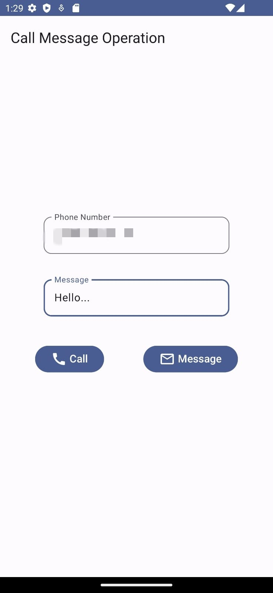
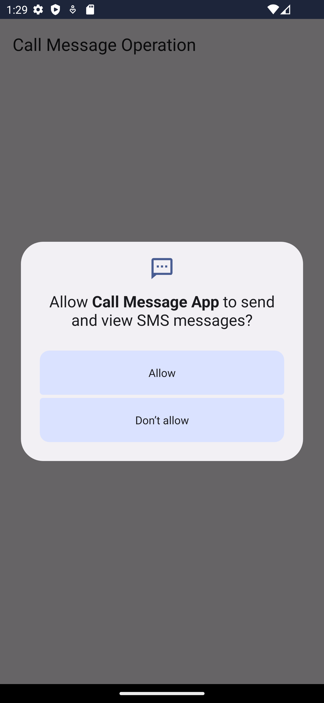
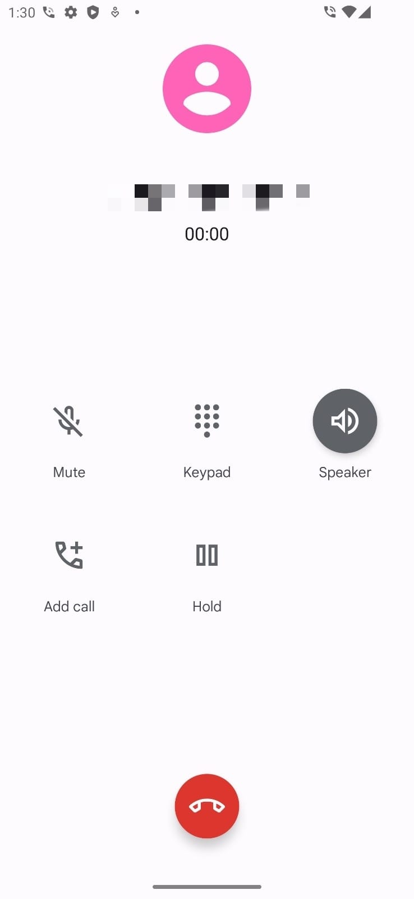

# Food Ordering App

You can make calls and send messages with this application. You can manage application permissions. When using the phone number, you can get it in formatted form from the user.

## Features

The main features of this project include:

- You can make phone calls in the application.
- You can send messages in the app.
- You can control and manage permissions for calls and messages.

## Technologies

We utilized the following key technologies and tools in the development of this project:

- Jetpack compose toolkit was used in the application.
- SMS manager was used to send messages in the application.

## User Interfaces

  
  
  
 

